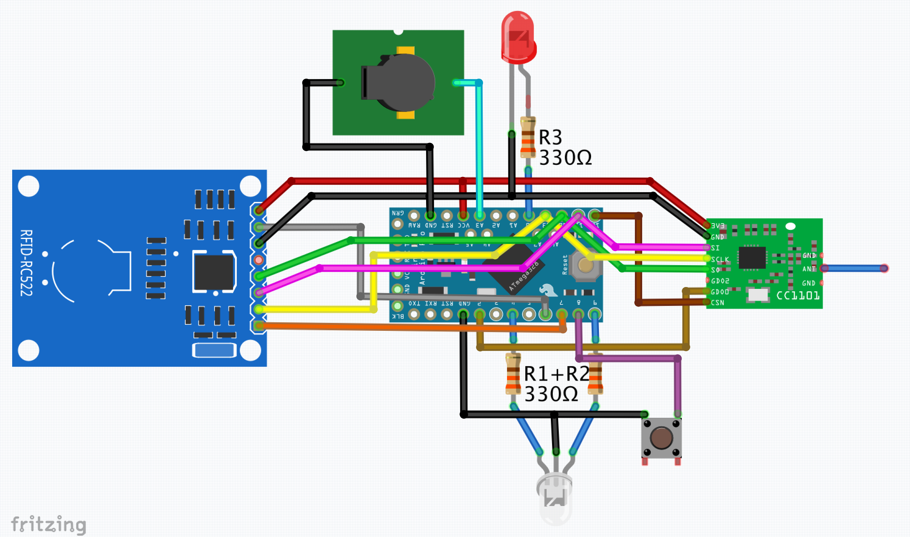

# HB-UNI-Sen-RFID-RC

_work in progress..._

Dieses Projekt soll in Anlehnung an mein [Wemos-RFID-Alarmanlagen-Projekt](https://github.com/jp112sdl/WemosD1_HomeMatic_RFID) eine netzwerkinfrastrukturunabhängige Lösung bieten.

#### Bauteile
- 1x Arduino Pro Mini (3.3V / 8MHz)
- 1x CC1101 868MHz Funkmodul
- 1x MFRC522 RFID Reader (z.B. [eBay](https://www.ebay.de/itm/252715001811))
- 3x Widerstand 330 Ohm
- 1x Duo-LED
- 1x LED 
- 1x Taster
- 1x Buzzer aktiv (z.B. [eBay](https://www.ebay.de/itm/332081758028))

#### Prototyp / Versuchsaufbau: 
</img> </img>

#### Verdrahtung

#### CCU Geräte/Bedienung

#### CCU Einstellungen

#### Steuerbefehle

Mithilfe von SUBMIT-Commands lassen sich einige Funktionen des Device steuern. 
Das Absetzen der Befehle erfolgt aus einem Skript heraus allgemein mit 
`dom.GetObject("BidCos-RF.<Device Serial>:<Ch#>.SUBMIT").State("<command>");`

| Funktion | Command |
|----------|---------|
|Setzen einer 4 Byte Chip ID `0815CAFE`|`0x08,0x15,0xca,0xfe,0x00,0x00,0x00`|
|Löschen einer Chip ID|`0xcc`|
|Erzwingen der Chip ID Übertragung zur CCU|`0xfe`|
|Invertieren der StandbyLed|`0xff,0x01` (invertiert) oder `0xff,0x00` (normal)|
|Buzzer EIN (dauerhaft)|`0xb1`|
|Buzzer AUS|`0xb0`|
|Buzzer Beep Intervall endlos|`0xba`|

Beispiel - Löschen der RFID Chip ID Kanal 4: 
`dom.GetObject("BidCos-RF.JPRFID0001:4.SUBMIT").State("0xcc");`
